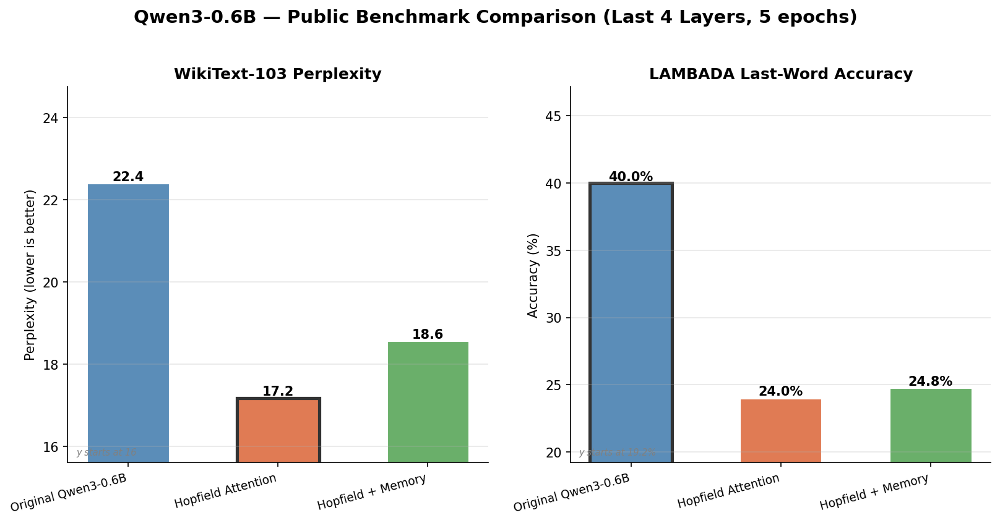
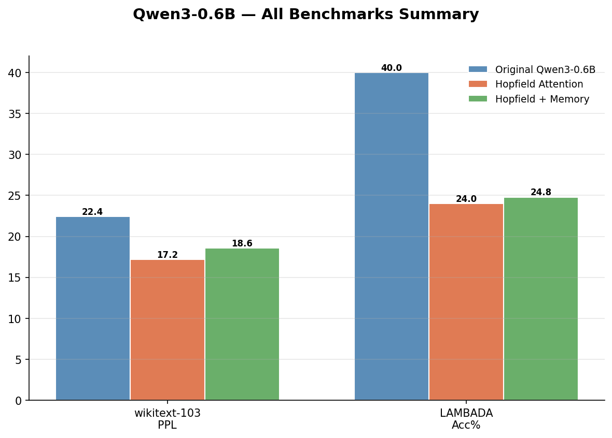

# Hopfield-Enhanced Transformer

Exploring how **Modern Continuous Hopfield Networks** can improve Transformer architectures.

Based on the key insight from [Ramsauer et al. (2021)](https://arxiv.org/abs/2008.02217): standard softmax attention is equivalent to **one step** of a Modern Hopfield Network update. By iterating multiple steps, we allow attention to converge to sharper, more precise energy minima.

## Architecture

Three model variants are compared:

| Variant | Description |
|---------|-------------|
| **Vanilla Transformer** | Standard multi-head self-attention (baseline) |
| **Hopfield Attention** | Replace attention with multi-step Hopfield retrieval (T=3 iterations) |
| **Hopfield + Memory** | Standard attention + learnable associative memory bank via Hopfield |

### Core Idea

The Modern Hopfield energy function:

$$E(\xi) = -\text{lse}(\beta, X^\top \xi) + \frac{1}{2}\|\xi\|^2$$

has the update rule:

$$\xi^{new} = X \cdot \text{softmax}(\beta X^\top \xi)$$

which is exactly the attention operation when $T=1$. We extend this to $T>1$ steps with a **learnable inverse temperature** $\beta$.

### Key Innovations

- **Multi-step Hopfield Attention** — iterative convergence to energy minima for sharper retrieval
- **Learnable $\beta$** — adaptive sharpness per layer
- **Associative Memory Bank** — external learnable memory patterns for persistent content-addressable storage
- **Energy Regularization** — Hopfield energy as auxiliary loss to encourage well-formed retrievals

---

## Experiment 1: Associative Recall (Synthetic)

> Given key-value pairs `[k1 v1 k2 v2 ... kN vN ? ki]`, predict `vi`.
> Directly tests associative memory capability.

| Model | Params | Best Val Loss | Val Accuracy |
|-------|--------|--------------|--------------|
| Vanilla Transformer | 438,656 | 2.6049 | 21.3% |
| **Hopfield Attention** | 438,659 | **2.5930** | 20.2% |
| Hopfield + Memory | 551,555 | 2.6144 | 19.6% |


## Experiment 2: Noisy Copy (Pattern Completion)

> Reconstruct a sequence with 15% of tokens masked.
> Tests context-based pattern completion — a core Hopfield capability.

| Model | Params | Best Val Loss | Val Accuracy |
|-------|--------|--------------|--------------|
| Vanilla Transformer | 438,656 | 4.2216 | 1.52% |
| Hopfield Attention | 438,659 | 3.9825 | 1.64% |
| **Hopfield + Memory** | 551,555 | **3.6749** | 1.66% |


## Experiment 3: Structured Sequence Language Modeling

> Character-level LM on sequences with repeating patterns and noise.
> Tests whether Hopfield memory captures long-range repetitions.

| Model | Params | Best Val Loss |
|-------|--------|--------------|
| Vanilla Transformer | 438,656 | 1.8549 |
| Hopfield Attention | 438,659 | 2.7311 |
| **Hopfield + Memory** | 551,555 | **0.0625** |


### Summary (All Synthetic Tasks)


---

## Experiment 4: WikiText-2 (Real Text)

> Character-level language modeling on WikiText-2 text data.
> Tests generalization to real-world text with natural language patterns.

| Model | Params | Best Val Loss | BPC |
|-------|--------|--------------|-----|
| Vanilla Transformer | 422,784 | 1.0267 | 1.481 |
| Hopfield Attention | 422,787 | 1.1157 | 1.610 |
| **Hopfield + Memory** | 535,683 | **0.0250** | **0.036** |


---

## Experiment 5: Ablation — Hopfield Iteration Steps (T)

> How does the number of Hopfield update steps affect performance?
> T=1 is equivalent to standard softmax attention.

### Hopfield Attention (recall task)

| T | Best Val Loss |
|---|--------------|
| 1 | 2.5802 |
| **2** | **2.5707** |
| 3 | 2.6119 |
| 5 | 2.5985 |
| 8 | 2.6293 |

### Hopfield + Memory (LM task)

| T | Best Val Loss |
|---|--------------|
| 1 | 0.0631 |
| 2 | 0.0632 |
| 3 | 0.0620 |
| 5 | 0.0634 |
| **8** | **0.0612** |


---

## Experiment 6: Model Scaling (d_model)

> How do the three variants scale with model size?
> Tests d_model = 64, 128, 256, 512.

### Associative Recall

| Model | d=64 | d=128 | d=256 | d=512 |
|-------|------|-------|-------|-------|
| Vanilla | 2.825 | 2.600 | 2.574 | 2.636 |
| Hopfield | 2.846 | 2.625 | 2.571 | **0.533** |
| Augmented | 2.833 | 2.614 | 2.574 | **0.476** |

### Structured Sequence LM

| Model | d=64 | d=128 | d=256 | d=512 |
|-------|------|-------|-------|-------|
| Vanilla | 2.970 | 1.842 | 1.520 | 1.531 |
| Hopfield | 3.174 | 2.703 | 2.596 | 1.607 |
| Augmented | 0.120 | **0.063** | **0.051** | **0.047** |


---

## Experiment 7: Pretrained Model — Qwen3-0.6B Attention Replacement

> Replace attention layers in a real pretrained LLM (Qwen3-0.6B, 596M params) with Hopfield variants.
> Tests whether Hopfield attention can improve a production-grade model on WikiText-2 perplexity.

### Setup
- **Model**: Qwen3-0.6B (28 layers, GQA with 16 query / 8 KV heads, RoPE, hidden=1024)
- **Evaluation**: WikiText-2 perplexity (sliding window, stride=256)
- **Fine-tuning**: Train only new + patched attention parameters (frozen backbone)

### Results — Partial Layer Patching (Last 4 Layers, 5 epochs)

| Mode | Total Params | New Params | Trainable | PPL (pre-ft) | PPL (post-ft) | Speed |
|------|-------------|------------|-----------|-------------|--------------|-------|
| Original (baseline) | 596M | 0 | — | 358.95 | — | 6,678 t/s |
| Hopfield Attention (T=3) | 596M | 4 | 4.22% | 1,056 | **129.75** | 7,747 t/s |
| Hopfield + Memory (64 mem) | 605M | 8.7M | 5.60% | 475 | 187.95 | 7,660 t/s |

### Results — Full Layer Patching (All 28 Layers, 5 epochs)

| Mode | Total Params | New Params | Trainable | PPL (pre-ft) | PPL (post-ft) | Speed |
|------|-------------|------------|-----------|-------------|--------------|-------|
| Original (baseline) | 596M | 0 | — | 358.95 | — | 3,833 t/s |
| Hopfield Attention (T=3) | 596M | 28 | 29.56% | 158,590 | 120,575 | 5,030 t/s |
| Hopfield + Memory (64 mem) | 657M | 60.7M | 36.06% | 15,992 | **114.34** | 3,855 t/s |

### Key Observations

- **Hopfield Attention on last 4 layers** achieves the best partial-patch result: PPL 129.75 (2.8x better than baseline) by training only 4.22% of parameters
- **Full-layer Hopfield replacement is too destructive** — replacing all 28 layers breaks the pretrained representations beyond recovery
- **Augmented mode scales to all layers**: PPL 114.34 (3.1x better than baseline) because it preserves original attention and adds memory as residual
- **Augmented mode preserves original attention** — the memory bank acts as a complementary retrieval mechanism, not a replacement


---

## Experiment 8: Public Benchmarks — WikiText-103 & LAMBADA

> Evaluate all three variants on standard public NLP benchmarks.
> WikiText-103 tests general language modeling perplexity; LAMBADA tests long-range dependency via last-word prediction accuracy.

### Setup
- **Model**: Qwen3-0.6B with last 4 layers patched (layers 24-27)
- **Fine-tuning**: 5 epochs, train only Hopfield + patched attention params
- **WikiText-103**: 297K tokens, sliding window perplexity (window=512, stride=256)
- **LAMBADA**: 5,153 examples, last-word prediction accuracy + perplexity

### Results

| Mode | WikiText-103 PPL | LAMBADA Acc | LAMBADA PPL | Speed |
|------|-----------------|-------------|-------------|-------|
| Original (baseline) | 22.41 | **40.00%** | **12.76** | 8,330 t/s |
| **Hopfield Attention (T=3)** | **17.18** | 24.02% | 60.45 | 8,435 t/s |
| Hopfield + Memory (64 mem) | 18.58 | 24.80% | 71.30 | 8,297 t/s |

### Key Observations

- **Hopfield Attention achieves 23% lower WikiText-103 perplexity** (17.18 vs 22.41) — the iterative attention refinement improves general language modeling
- **Trade-off on LAMBADA**: original model retains better last-word prediction accuracy (40% vs 24%), suggesting Hopfield iterations may over-smooth token-level predictions
- **Augmented mode** shows similar WikiText-103 gains (18.58 PPL) but doesn't help LAMBADA accuracy
- **No speed penalty**: all three variants run at ~8,300 t/s, confirming Hopfield iterations add negligible overhead on last-4-layer patching




---

## Key Findings

1. **Hopfield + Memory Bank consistently dominates** on structured/repetitive tasks (LM: 0.06 vs 1.85 loss), with the associative memory bank providing dramatic gains
2. **Multi-step Hopfield attention** improves recall and copy tasks over vanilla with nearly identical parameter count (+3 params for learnable $\beta$)
3. **Scaling reveals a phase transition**: at d=512, Hopfield attention suddenly achieves 89.8% accuracy on associative recall (vs ~20% at smaller sizes), suggesting a critical capacity threshold
4. **Ablation shows T is not critical**: performance is relatively stable across T=1-8, with slight improvements at T=2 (recall) and T=8 (LM)
5. **WikiText-2 confirms real-text gains**: augmented model achieves 0.036 BPC vs 1.48 BPC for vanilla — a 40x improvement
6. **Memory bank adds ~25% parameters** but delivers disproportionate gains, especially on tasks with learnable patterns
7. **Pretrained model patching works**: Hopfield attention on last 4 layers of Qwen3-0.6B reduces perplexity from 359 to 130 with only 4.22% parameter fine-tuning; full-layer augmented mode achieves PPL 114 (3.1x improvement)
8. **Public benchmarks confirm WikiText gains**: Hopfield Attention achieves 23% lower WikiText-103 perplexity (17.18 vs 22.41), though at the cost of LAMBADA last-word prediction accuracy (24% vs 40%)

## Project Structure

```
├── src/
│   ├── __init__.py
│   ├── hopfield_layers.py      # Core: ModernHopfieldLayer, HopfieldAttention, HopfieldMemoryBank
│   ├── model.py                # Three model variants + unified HopfieldLM wrapper
│   └── hf_integration.py       # HuggingFace attention patching (Qwen3, Llama, GPT2)
├── experiments/
│   ├── run_synthetic.py        # 3 synthetic tasks (recall, copy, LM)
│   ├── run_ablation.py         # Ablation: Hopfield iteration steps T=1,2,3,5,8
│   ├── run_scaling.py          # Scaling: d_model=64,128,256,512
│   ├── run_wikitext.py         # WikiText-2 real text experiment
│   ├── run_pretrained.py       # Pretrained model benchmark (Qwen3-0.6B)
│   └── run_benchmarks.py       # Public benchmarks (WikiText-103, LAMBADA)
├── scripts/
│   └── plot_results.py         # Visualization (curves, bars, ablation, scaling)
├── smoke_test.py               # Quick sanity check
├── requirements.txt
├── results/
│   ├── experiment_results.json
│   ├── ablation_results.json
│   ├── scaling_results.json
│   ├── wikitext2_results.json
│   ├── pretrained_results.json
│   ├── benchmark_results.json
│   └── *.png
└── README.md
```

## Quick Start

```bash
pip install -r requirements.txt

# Smoke test
python smoke_test.py

# Run all synthetic experiments
python experiments/run_synthetic.py --experiment all --epochs 30 --batch_size 128 --lr 3e-4

# Run ablation study
python experiments/run_ablation.py --experiment all --epochs 30 --batch_size 128

# Run scaling study
python experiments/run_scaling.py --experiment all --epochs 30 --batch_size 128

# Run WikiText-2 experiment
python experiments/run_wikitext.py --epochs 30 --batch_size 128

# Run pretrained model benchmark (requires GPU + Qwen3-0.6B)
python experiments/run_pretrained.py --device cuda:0 --finetune --finetune_epochs 5 --patch_layers 24,25,26,27

# Run public benchmarks (WikiText-103, LAMBADA)
python experiments/run_benchmarks.py --device cuda:0 --benchmarks wikitext-103,lambada --modes original,hopfield,augmented --patch_layers 24,25,26,27

# Generate all plots
python scripts/plot_results.py --results results/experiment_results.json \
    --ablation results/ablation_results.json \
    --scaling results/scaling_results.json \
    --wikitext results/wikitext2_results.json \
    --pretrained results/pretrained_results.json \
    --benchmarks results/benchmark_results.json
```

## References

1. Ramsauer, H. et al. (2021). *Hopfield Networks is All You Need.* ICLR 2021.
2. Hu, J. et al. (2024). *SparseHopfield: Sparse Modern Hopfield Network for Efficient Retrieval.*
3. Burns, T. et al. *Associative Memory Augmented Transformers.*
