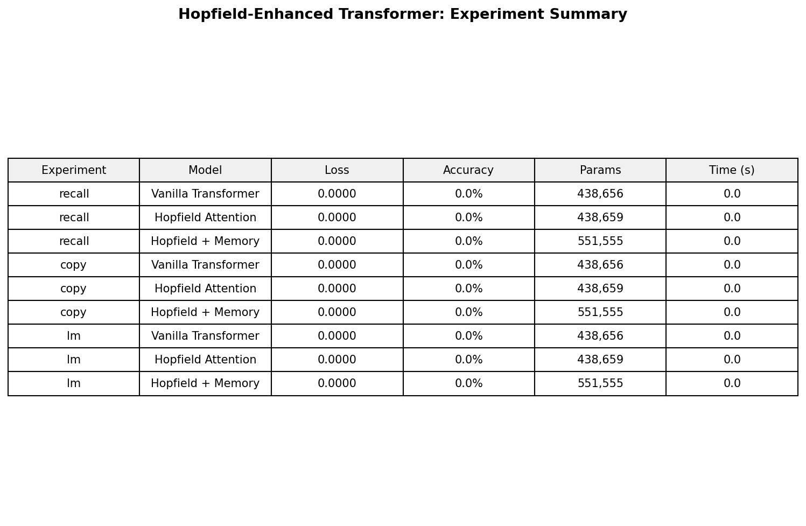

# Hopfield-Enhanced Transformer

Exploring how **Modern Continuous Hopfield Networks** can improve Transformer architectures.

Based on the key insight from [Ramsauer et al. (2021)](https://arxiv.org/abs/2008.02217): standard softmax attention is equivalent to **one step** of a Modern Hopfield Network update. By iterating multiple steps, we allow attention to converge to sharper, more precise energy minima.

## Architecture

Three model variants are compared:

| Variant | Description |
|---------|-------------|
| **Vanilla Transformer** | Standard multi-head self-attention (baseline) |
| **Hopfield Attention** | Replace attention with multi-step Hopfield retrieval (T=3 iterations) |
| **Hopfield + Memory** | Standard attention + learnable associative memory bank via Hopfield |

### Core Idea

The Modern Hopfield energy function:

$$E(\xi) = -\text{lse}(\beta, X^\top \xi) + \frac{1}{2}\|\xi\|^2$$

has the update rule:

$$\xi^{new} = X \cdot \text{softmax}(\beta X^\top \xi)$$

which is exactly the attention operation when $T=1$. We extend this to $T>1$ steps with a **learnable inverse temperature** $\beta$.

### Key Innovations

- **Multi-step Hopfield Attention** — iterative convergence to energy minima for sharper retrieval
- **Learnable $\beta$** — adaptive sharpness per layer
- **Associative Memory Bank** — external learnable memory patterns for persistent content-addressable storage
- **Energy Regularization** — Hopfield energy as auxiliary loss to encourage well-formed retrievals

## Experiment Results

### Experiment 1: Associative Recall

> Given key-value pairs `[k1 v1 k2 v2 ... kN vN ? ki]`, predict `vi`.
> Directly tests associative memory capability.

| Model | Params | Best Val Loss | Val Accuracy |
|-------|--------|--------------|--------------|
| Vanilla Transformer | 438,656 | 2.6384 | 19.5% |
| Hopfield Attention | 438,659 | 2.5894 | 20.4% |
| **Hopfield + Memory** | 551,555 | **2.5747** | **21.1%** |


### Experiment 2: Noisy Copy (Pattern Completion)

> Reconstruct a sequence with 15% of tokens masked.
> Tests context-based pattern completion — a core Hopfield capability.

| Model | Params | Best Val Loss | Val Accuracy |
|-------|--------|--------------|--------------|
| Vanilla Transformer | 438,656 | 4.2305 | 1.81% |
| Hopfield Attention | 438,659 | 3.9897 | 1.37% |
| **Hopfield + Memory** | 551,555 | **3.7045** | 1.73% |


### Experiment 3: Structured Sequence Language Modeling

> Character-level LM on sequences with repeating patterns and noise.
> Tests whether Hopfield memory captures long-range repetitions.

| Model | Params | Best Val Loss |
|-------|--------|--------------|
| Vanilla Transformer | 438,656 | 1.8328 |
| Hopfield Attention | 438,659 | 2.7088 |
| **Hopfield + Memory** | 551,555 | **0.0621** |


### Summary



**Key Findings:**
- **Hopfield + Memory** consistently achieves the best validation loss across all three tasks
- The associative memory bank is particularly powerful for structured/repetitive sequences (LM task: 0.06 vs 1.83)
- Multi-step Hopfield attention alone improves recall and copy tasks over vanilla, with nearly identical parameter count (+3 params for learnable $\beta$)
- The memory bank adds ~25% parameters but delivers disproportionate gains

## Project Structure

```
├── hopfield_layers.py    # Core: ModernHopfieldLayer, HopfieldAttention, HopfieldMemoryBank
├── model.py              # Three model variants + unified HopfieldLM wrapper
├── run_experiments.py     # Training loop + 3 synthetic experiments
├── plot_results.py        # Visualization
├── smoke_test.py          # Quick sanity check
├── requirements.txt
└── results/
    ├── experiment_results.json
    ├── recall_comparison.png
    ├── copy_comparison.png
    ├── lm_comparison.png
    └── summary_table.png
```

## Quick Start

```bash
pip install torch>=2.0.0 matplotlib

# Smoke test
python smoke_test.py

# Run all experiments
python run_experiments.py --experiment all --epochs 30 --batch_size 128 --lr 3e-4

# Generate plots
python plot_results.py
```

## References

1. Ramsauer, H. et al. (2021). *Hopfield Networks is All You Need.* ICLR 2021.
2. Hu, J. et al. (2024). *SparseHopfield: Sparse Modern Hopfield Network for Efficient Retrieval.*
3. Burns, T. et al. *Associative Memory Augmented Transformers.*
