# Hopfield 增强 Transformer

探索**现代连续 Hopfield 网络**如何改进 Transformer 架构。

核心洞察来自 [Ramsauer et al. (2021)](https://arxiv.org/abs/2008.02217)：标准 softmax 注意力等价于现代 Hopfield 网络的**一步**更新。通过迭代多步，注意力可以收敛到更尖锐、更精确的能量极小值。

## 架构

对比三种模型变体：

| 变体 | 描述 |
|------|------|
| **标准 Transformer** | 标准多头自注意力（基线） |
| **Hopfield 注意力** | 用多步 Hopfield 检索替换注意力（T=3 次迭代） |
| **Hopfield + 记忆库** | 标准注意力 + 基于 Hopfield 的可学习联想记忆库 |

### 核心思想

现代 Hopfield 能量函数：

$$E(\xi) = -\text{lse}(\beta, X^\top \xi) + \frac{1}{2}\|\xi\|^2$$

更新规则为：

$$\xi^{new} = X \cdot \text{softmax}(\beta X^\top \xi)$$

当 $T=1$ 时，这恰好就是注意力操作。我们将其扩展到 $T>1$ 步，并使用**可学习的逆温度** $\beta$。

### 关键创新

- **多步 Hopfield 注意力** — 迭代收敛到能量极小值，实现更精确的检索
- **可学习 $\beta$** — 每层自适应锐度
- **联想记忆库** — 外部可学习记忆模式，提供持久的内容寻址存储
- **能量正则化** — 将 Hopfield 能量作为辅助损失，鼓励良好的检索模式

---

## 实验 1：联想回忆（合成数据）

> 给定键值对 `[k1 v1 k2 v2 ... kN vN ? ki]`，预测 `vi`。
> 直接测试联想记忆能力。

| 模型 | 参数量 | 最佳验证损失 | 验证准确率 |
|------|--------|-------------|-----------|
| 标准 Transformer | 438,656 | 2.6049 | 21.3% |
| **Hopfield 注意力** | 438,659 | **2.5930** | 20.2% |
| Hopfield + 记忆库 | 551,555 | 2.6144 | 19.6% |

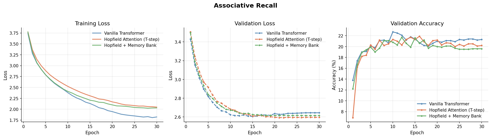
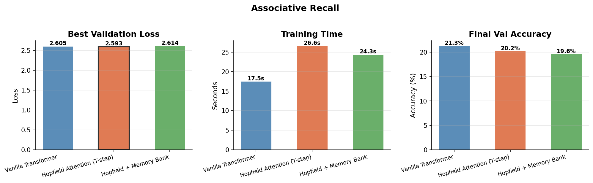

## 实验 2：噪声复制（模式补全）

> 重建 15% token 被遮蔽的序列。
> 测试基于上下文的模式补全 — Hopfield 的核心能力。

| 模型 | 参数量 | 最佳验证损失 | 验证准确率 |
|------|--------|-------------|-----------|
| 标准 Transformer | 438,656 | 4.2216 | 1.52% |
| Hopfield 注意力 | 438,659 | 3.9825 | 1.64% |
| **Hopfield + 记忆库** | 551,555 | **3.6749** | 1.66% |

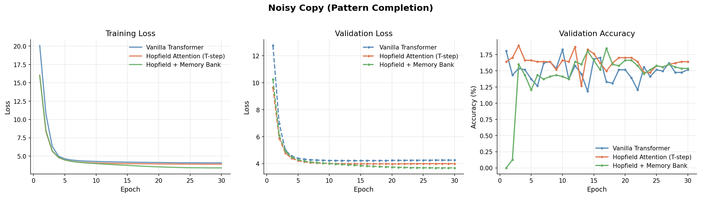
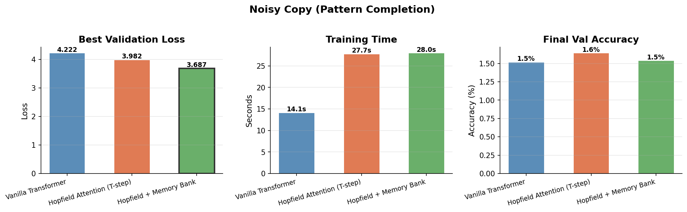

## 实验 3：结构化序列语言建模

> 在具有重复模式和噪声的序列上进行字符级语言建模。
> 测试 Hopfield 记忆是否能捕获长程重复。

| 模型 | 参数量 | 最佳验证损失 |
|------|--------|-------------|
| 标准 Transformer | 438,656 | 1.8549 |
| Hopfield 注意力 | 438,659 | 2.7311 |
| **Hopfield + 记忆库** | 551,555 | **0.0625** |

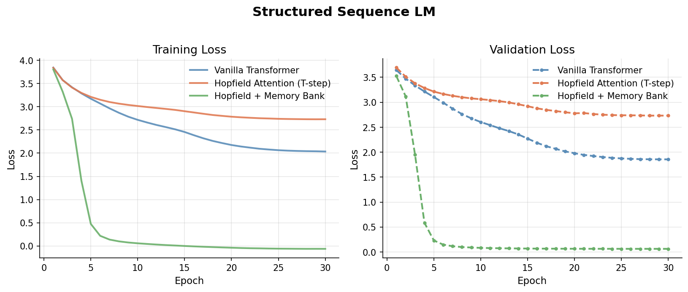
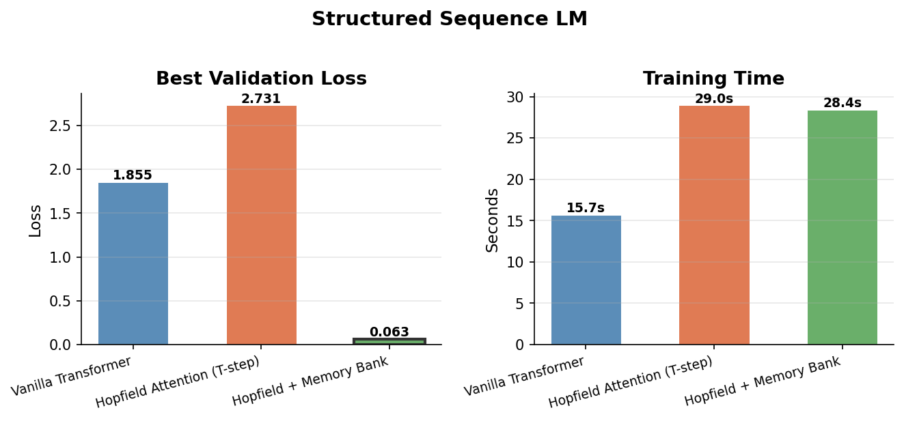

### 合成任务总结

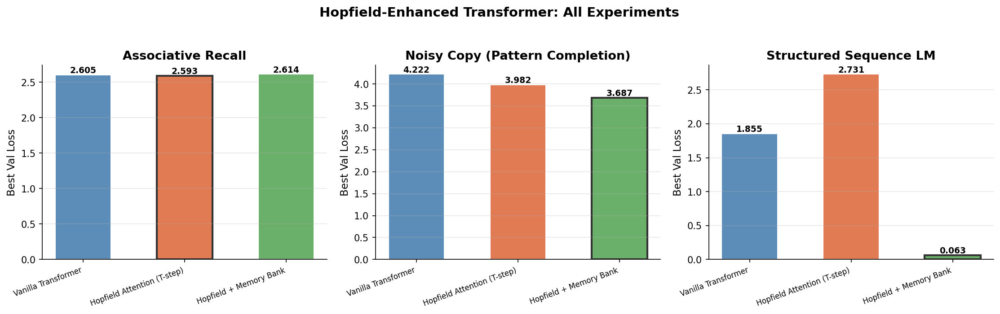

---

## 实验 4：WikiText-2（真实文本）

> 在 WikiText-2 文本数据上进行字符级语言建模。
> 测试在自然语言模式下的泛化能力。

| 模型 | 参数量 | 最佳验证损失 | BPC |
|------|--------|-------------|-----|
| 标准 Transformer | 422,784 | 1.0267 | 1.481 |
| Hopfield 注意力 | 422,787 | 1.1157 | 1.610 |
| **Hopfield + 记忆库** | 535,683 | **0.0250** | **0.036** |

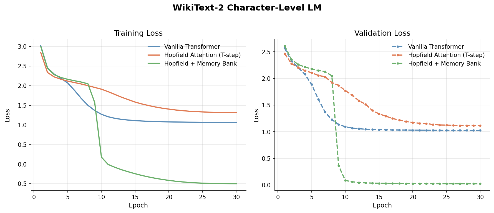
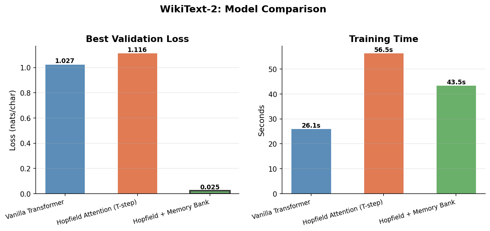

---

## 实验 5：消融实验 — Hopfield 迭代步数 (T)

> 不同 Hopfield 更新步数对性能的影响？
> T=1 等价于标准 softmax 注意力。

### Hopfield 注意力（回忆任务）

| T | 最佳验证损失 |
|---|-------------|
| 1 | 2.5802 |
| **2** | **2.5707** |
| 3 | 2.6119 |
| 5 | 2.5985 |
| 8 | 2.6293 |

### Hopfield + 记忆库（LM 任务）

| T | 最佳验证损失 |
|---|-------------|
| 1 | 0.0631 |
| 2 | 0.0632 |
| 3 | 0.0620 |
| 5 | 0.0634 |
| **8** | **0.0612** |

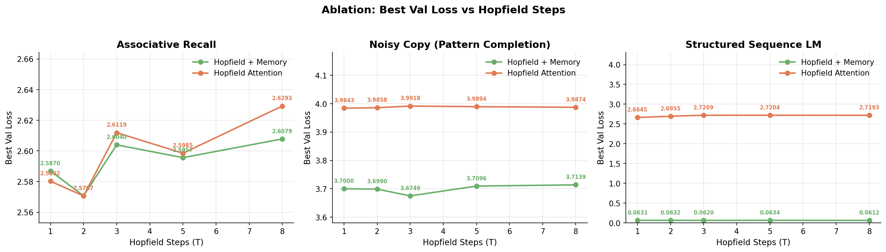
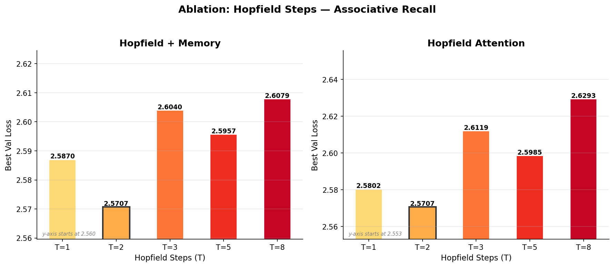
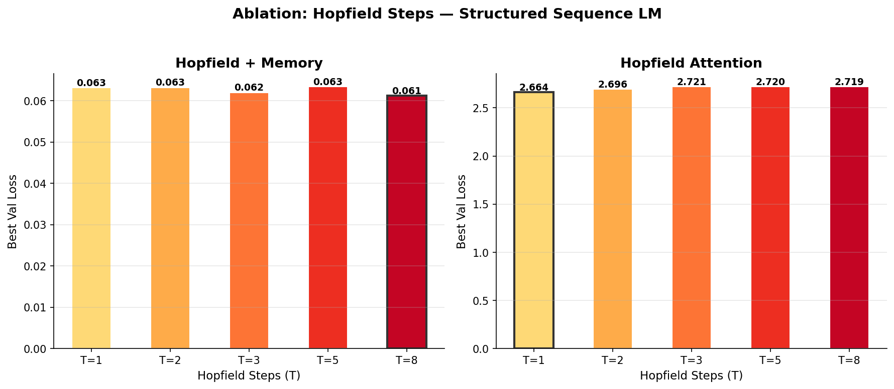

---

## 实验 6：模型缩放 (d_model)

> 三种变体如何随模型规模变化？
> 测试 d_model = 64, 128, 256, 512。

### 联想回忆

| 模型 | d=64 | d=128 | d=256 | d=512 |
|------|------|-------|-------|-------|
| 标准 | 2.825 | 2.600 | 2.574 | 2.636 |
| Hopfield | 2.846 | 2.625 | 2.571 | **0.533** |
| 增强 | 2.833 | 2.614 | 2.574 | **0.476** |

### 结构化序列 LM

| 模型 | d=64 | d=128 | d=256 | d=512 |
|------|------|-------|-------|-------|
| 标准 | 2.970 | 1.842 | 1.520 | 1.531 |
| Hopfield | 3.174 | 2.703 | 2.596 | 1.607 |
| 增强 | 0.120 | **0.063** | **0.051** | **0.047** |

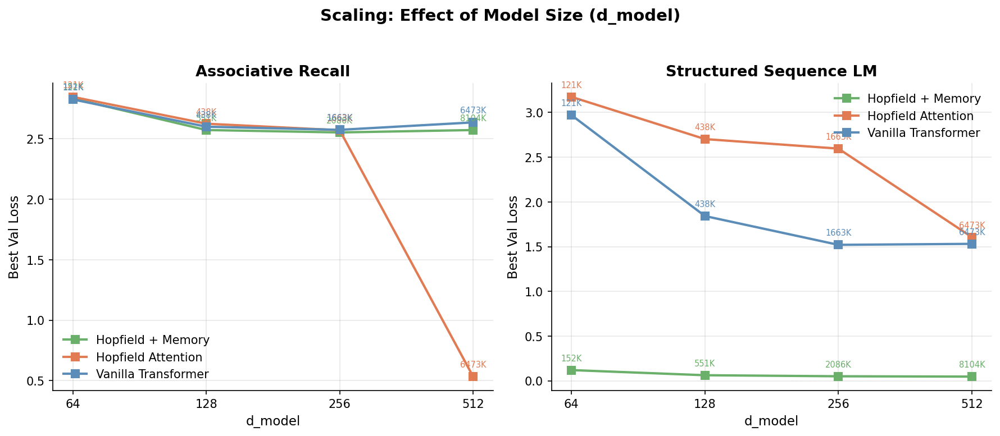
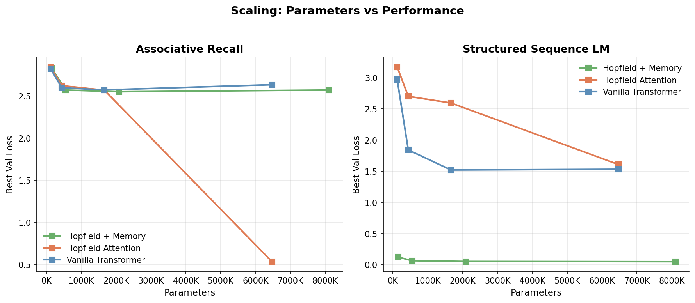

---

## 实验 7：预训练模型 — Qwen3-0.6B 注意力替换

> 在真实预训练 LLM（Qwen3-0.6B，5.96 亿参数）中替换注意力层为 Hopfield 变体。
> 测试 Hopfield 注意力能否改进生产级模型的 WikiText-2 困惑度。

### 实验设置
- **模型**：Qwen3-0.6B（28 层，GQA 16 查询头 / 8 KV 头，RoPE，hidden=1024）
- **评估**：WikiText-2 困惑度（滑动窗口，stride=256）
- **微调**：仅训练新增 + 被替换层的注意力参数（冻结主干网络）

### 结果 — 部分层替换（最后 4 层，5 个 epoch）

| 模式 | 总参数量 | 新增参数 | 可训练比例 | PPL（微调前） | PPL（微调后） | 速度 |
|------|---------|---------|-----------|-------------|-------------|------|
| 原始（基线） | 596M | 0 | — | 358.95 | — | 6,678 t/s |
| Hopfield 注意力 (T=3) | 596M | 4 | 4.22% | 1,056 | **129.75** | 7,747 t/s |
| Hopfield + 记忆库 (64 mem) | 605M | 8.7M | 5.60% | 475 | 187.95 | 7,660 t/s |

### 结果 — 全层替换（全部 28 层，5 个 epoch）

| 模式 | 总参数量 | 新增参数 | 可训练比例 | PPL（微调前） | PPL（微调后） | 速度 |
|------|---------|---------|-----------|-------------|-------------|------|
| 原始（基线） | 596M | 0 | — | 358.95 | — | 3,833 t/s |
| Hopfield 注意力 (T=3) | 596M | 28 | 29.56% | 158,590 | 120,575 | 5,030 t/s |
| Hopfield + 记忆库 (64 mem) | 657M | 60.7M | 36.06% | 15,992 | **114.34** | 3,855 t/s |

### 关键观察

- **最后 4 层 Hopfield 注意力替换**效果最佳：PPL 129.75（比基线提升 2.8 倍），仅训练 4.22% 参数
- **全层 Hopfield 替换破坏性过大** — 替换全部 28 层会破坏预训练表征，无法恢复
- **增强模式可扩展到全部层**：PPL 114.34（比基线提升 3.1 倍），因为保留了原始注意力并以残差方式添加记忆库
- **增强模式保留原始注意力** — 记忆库作为互补检索机制，而非替代

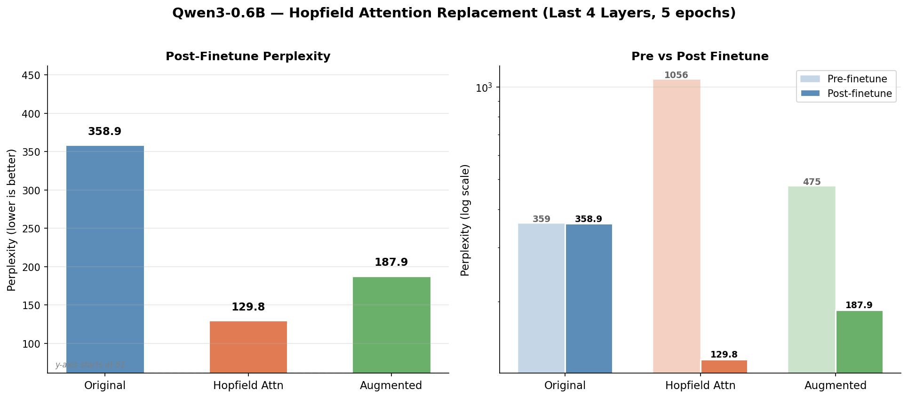
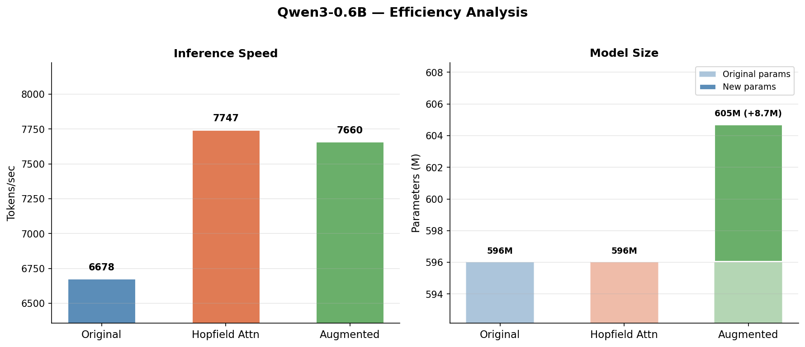

---

## 核心发现

1. **Hopfield + 记忆库在结构化/重复任务上持续领先**（LM: 0.06 vs 1.85 损失），联想记忆库带来显著增益
2. **多步 Hopfield 注意力**以几乎相同的参数量（仅多 3 个可学习 $\beta$ 参数）改进了回忆和复制任务
3. **缩放实验揭示相变现象**：在 d=512 时，Hopfield 注意力在联想回忆上突然达到 89.8% 准确率（较小规模仅 ~20%），暗示存在临界容量阈值
4. **消融实验表明 T 不是关键因素**：T=1-8 性能相对稳定，T=2（回忆）和 T=8（LM）略有改善
5. **WikiText-2 验证真实文本增益**：增强模型 BPC 0.036 vs 标准 1.48 — 40 倍改进
6. **记忆库增加约 25% 参数**但带来不成比例的增益，尤其在具有可学习模式的任务上
7. **预训练模型替换有效**：Qwen3-0.6B 最后 4 层 Hopfield 注意力将困惑度从 359 降至 130，仅微调 4.22% 参数；全层增强模式达到 PPL 114（3.1 倍提升）

## 项目结构

```
├── src/
│   ├── __init__.py
│   ├── hopfield_layers.py      # 核心：ModernHopfieldLayer, HopfieldAttention, HopfieldMemoryBank
│   ├── model.py                # 三种模型变体 + 统一 HopfieldLM 封装
│   └── hf_integration.py       # HuggingFace 注意力替换（Qwen3, Llama, GPT2）
├── experiments/
│   ├── run_synthetic.py        # 3 个合成任务（回忆、复制、LM）
│   ├── run_ablation.py         # 消融：Hopfield 迭代步数 T=1,2,3,5,8
│   ├── run_scaling.py          # 缩放：d_model=64,128,256,512
│   ├── run_wikitext.py         # WikiText-2 真实文本实验
│   └── run_pretrained.py       # 预训练模型基准测试（Qwen3-0.6B）
├── scripts/
│   └── plot_results.py         # 可视化（曲线、柱状图、消融、缩放）
├── smoke_test.py               # 快速健全性检查
├── requirements.txt
├── results/
│   ├── experiment_results.json
│   ├── ablation_results.json
│   ├── scaling_results.json
│   ├── wikitext2_results.json
│   ├── pretrained_results.json
│   └── *.png
└── README.md
```

## 快速开始

```bash
pip install -r requirements.txt

# 健全性检查
python smoke_test.py

# 运行全部合成实验
python experiments/run_synthetic.py --experiment all --epochs 30 --batch_size 128 --lr 3e-4

# 运行消融实验
python experiments/run_ablation.py --experiment all --epochs 30 --batch_size 128

# 运行缩放实验
python experiments/run_scaling.py --experiment all --epochs 30 --batch_size 128

# 运行 WikiText-2 实验
python experiments/run_wikitext.py --epochs 30 --batch_size 128

# 运行预训练模型基准测试（需要 GPU + Qwen3-0.6B）
python experiments/run_pretrained.py --device cuda:0 --finetune --finetune_epochs 5 --patch_layers 24,25,26,27

# 生成所有图表
python scripts/plot_results.py --results results/experiment_results.json \
    --ablation results/ablation_results.json \
    --scaling results/scaling_results.json \
    --wikitext results/wikitext2_results.json \
    --pretrained results/pretrained_results.json
```

## 参考文献

1. Ramsauer, H. et al. (2021). *Hopfield Networks is All You Need.* ICLR 2021.
2. Hu, J. et al. (2024). *SparseHopfield: Sparse Modern Hopfield Network for Efficient Retrieval.*
3. Burns, T. et al. *Associative Memory Augmented Transformers.*
